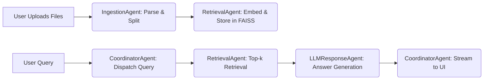

# DocAgent :Agentic RAG-Powered Multi-Format Document QA

[](https://huggingface.co/spaces/ragunath-ravi/DocAgent)

---

## 📜 Overview

**DocAgent** is a technically advanced, agent-based document QA system that uses Retrieval-Augmented Generation (RAG) and a Model Context Protocol (MCP) to orchestrate autonomous agents that parse, embed, retrieve, and generate answers from multi-format documents including PDF, PPTX, DOCX, CSV, TXT, and Markdown. 

It is implemented with LangChain, HuggingFace, FAISS, Gradio, and Open Source LLMs. 

---

## 🧱 Architecture: Model Context Protocol (MCP) + Agents

### MCP (Model Context Protocol)
MCP is a lightweight, structured message-passing protocol between agents. Each agent receives, processes, and responds using `MCPMessage` over a `MessageBus`.

```python
class MCPMessage:
    sender: str
    receiver: str
    type: str
    trace_id: str
    payload: Dict
```

---

## 👷 Agents

### 1. IngestionAgent
- Parses files in `.pdf`, `.pptx`, `.docx`, `.csv`, `.txt`, `.md`
- Uses file-type-specific parsing logic: `PyPDF2`, `python-pptx`, `python-docx`, `pandas`, and plain-text readers
- Utilizes `RecursiveCharacterTextSplitter` for chunking
- Sends chunked LangChain `Document` objects to `RetrievalAgent`

### 2. RetrievalAgent
- Embeds chunked documents using `sentence-transformers/all-MiniLM-L6-v2`
- Stores chunks in FAISS vector store
- Handles query requests by returning top-k similar chunks
- Sends `retrieved_context` to `LLMResponseAgent`

### 3. LLMResponseAgent
- Accepts user question and retrieved context
- Constructs system and user messages for a chat-based inference
- Calls HuggingFace's `InferenceClient.chat_completion()` for token streaming
- Streams responses back to `CoordinatorAgent`

### 4. CoordinatorAgent
- Central orchestrator for all user interactions
- Tracks document ingestion status
- Collects streamed LLM responses and sends them to Gradio UI

---

## 🧠 Semantic Search + Vector Store
- All documents are embedded using HuggingFace Sentence Transformers
- FAISS provides fast approximate nearest-neighbor search
- Retrieval is controlled via top-k selection (default: `k=3`)

---

## 🖥️ Gradio Interface

The frontend is powered by a Gradio `Blocks` layout with custom CSS. It features:

- Multi-file uploader with type restrictions
- Upload and processing feedback
- Streaming chatbot interface
- Example prompt suggestions

### Supported File Types
- PDF
- PowerPoint (PPTX)
- Word Documents (DOCX)
- CSV
- TXT
- Markdown

---

## 🧪 Inference Pipeline Walkthrough



---

## ⚙️ Tech Stack

| Layer              | Technology                                 |
|-------------------|---------------------------------------------|
| Language Model     | meta-llama/Llama-3.1-8B-Instruct (HuggingFace) |
| Vector Store       | FAISS                                       |
| Embeddings         | HuggingFace Sentence Transformers           |
| Agent Framework    | Custom (MCP + Python OOP)                   |
| UI Frontend        | Gradio + Custom CSS                         |
| Document Parsing   | PyPDF2, python-docx, python-pptx, pandas    |

---

## 🔐 Environment Requirements

```bash
pip install gradio langchain faiss-cpu pandas python-docx python-pptx PyPDF2 huggingface_hub sentence-transformers
```

Add your HuggingFace API key as an environment variable:

```bash
export hf_token=your_hf_token_here
```

---

## 🚀 Run Locally

```bash
python app.py
```

Or launch with Gradio Share:

```python
iface = create_interface()
iface.launch(share=True)
```

---

## 📦 Output
- Responses are streamed token-by-token
- Sources are included inline
- Supports concurrent queries and multiple file types

---

## 🤖 Demo

Try the live app on HuggingFace Spaces:
👉 [DocAgent on HuggingFace](https://huggingface.co/spaces/ragunath-ravi/DocAgent)

---

## 🧩 Future Enhancements
- Multi-agent asynchronous coordination
- LLM agent fine-tuning with document-type prompts
- File deletion, update, and versioning
- Conversation memory

---

## 📄 License
Apache 2.0

---

## 🧑‍💻 Author
**Ragunath Ravi**  
Saveetha Engineering College  
GitHub: [@ragunath-ravi](https://github.com/ragu-123)
